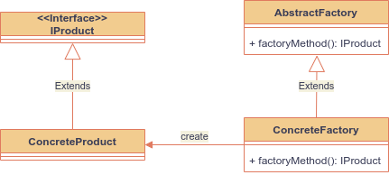
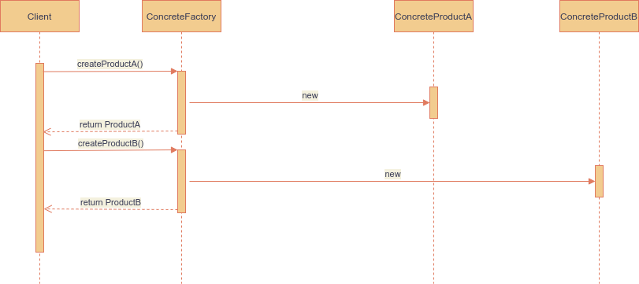

# Factory Method Pattern
Patrón que se centra en la creación de una clase fábrica la cual tiene métodos que nos permitan crear
objetos de un subtipo determinado.

Factory Method permite la creación de objetos de un subtipo determinado a través de una clase Factory.
Esto es especialmente útil cuando no sabemos, en tiempo de diseño, el subtipo que vamos a utilizar
o cuando queremos delegar la lógica de creación de los objetos a una clase Factory. Ultilizando este
patrón podemos crear instancias dinámicamente mediante la configuración, estableciendo cual será la
implementación a utilizar en un archivo de texto, XML, *properties* o mediante cualquier otra estrategia.

## Patrón de diseño Factory Method

Los componentes que conforman el patrón son los siguientes:

* **IProduct:** Representa de forma abstracta el objeto que queremos crear, mediante esta interface se
  define la estructura que tendrá el objeto creado.
* **ConcreteProduct:** Representa una implementación concreta de la interface *IProduct*, la cual es
  creada a través del *ConcreteFactory*.
* **ConcreteFactory:** Representa una fábrica concreta la cual es utilizada para la creación de
  *ConcreteProduct*, esta clase hereda el comportamiento básico del *AbstractFactory*.
* **AbrstracFactory:** Este componente puede ser opcional, sin embargo, se recomienda la creación de
  un *AbstractFactory* que define el comportamiento por default de los *ConcreteFactory*.

## Factory Method - Diagrama de secuencia

